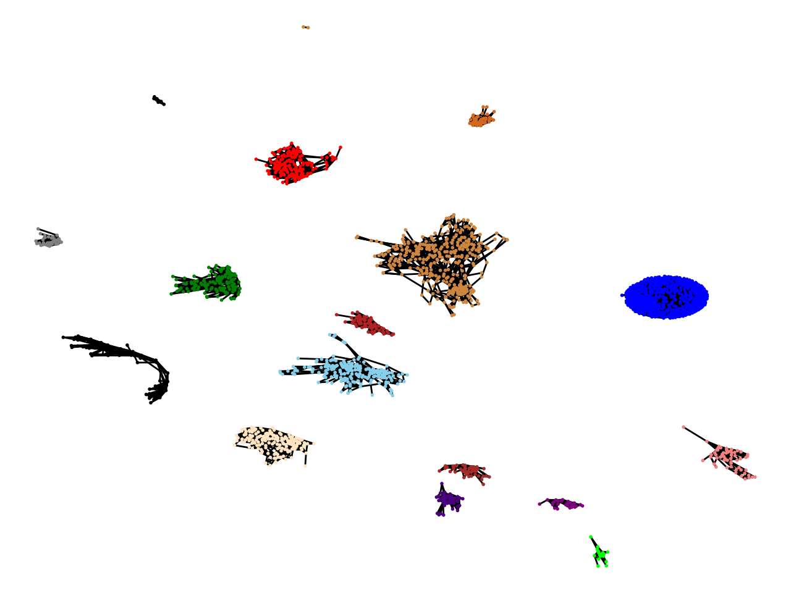

# paper-recommender

This is a joint project with [Nivasini Ananthakrishnan](https://nivasini.github.io/). 

Given a field (or subfield) of computer science, this project aims to find a set of ```n``` representative publications across different subfields. Although this question is concrete, this problem can be generalized to find the top ```n``` most "influential" nodes in a graph for some definition of influential. 

We tried out these experiments in the subfield of theoretical computer science. We used [Microsoft Knowledge API](https://docs.microsoft.com/en-us/academic-services/knowledge-exploration-service/?view=makes-3.0) to query metadata from publications from theoretical CS in conferences such as STOC, FOCS, SODA, ICALP, CCC, and IPCO. One can modify the ```conflist``` variable in ```relevant_papers_query.py``` to modify the list of conferences.

Data about each publication includes where it was published, the citation count, and also the list of papers citing it. In ```citationGraph.py```, we constructed a graph and its corresponding adjacency list. We processed the graph to exclude nodes with low degree (papers will low citation count). We also ensured the graph was connected by adding edges to connect disconnected components. 

We used [Spectral Clustering](https://en.wikipedia.org/wiki/Spectral_clustering) to paritition the graph into ```n``` clusters. From each cluster, we output the node with the highest citation. 

The following packages need to be installed: 

```
$ pip3 install sklearn 
$ pip3 install networkX 
$ pip3 install matplotlib 
$ pip3 install numpy

```

The number of clusters can be modified by changing ```num_clusters``` in ```citationGraph.py```. 

The final output can be obtained by running 

```$ python3 citationGraph.py```

When we ran it, the output set of papers we got were the following, 
```
approaching optimality for solving sdd linear systems
approximate counting via correlation decay in spin systems
simpler and better approximation algorithms for network design
constant round non malleable protocols using one way functions
maximizing non monotone submodular functions
mechanism design via differential privacy
quasipolynomial time identity testing of non commutative and read once oblivious algebraic branching programs
a strong direct product theorem for disjointness
an impossibility result for truthful combinatorial auctions with submodular valuations
low rank approximation and regression in input sparsity time
robust estimators in high dimensions without the computational intractability
bounded independence fools degree 2 threshold functions
explicit two source extractors and resilient functions
popular conjectures imply strong lower bounds for dynamic problems
property testing lower bounds via communication complexity

```

Graphs clusters look like the following: 


